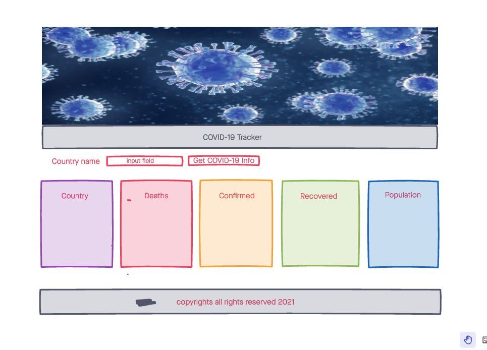
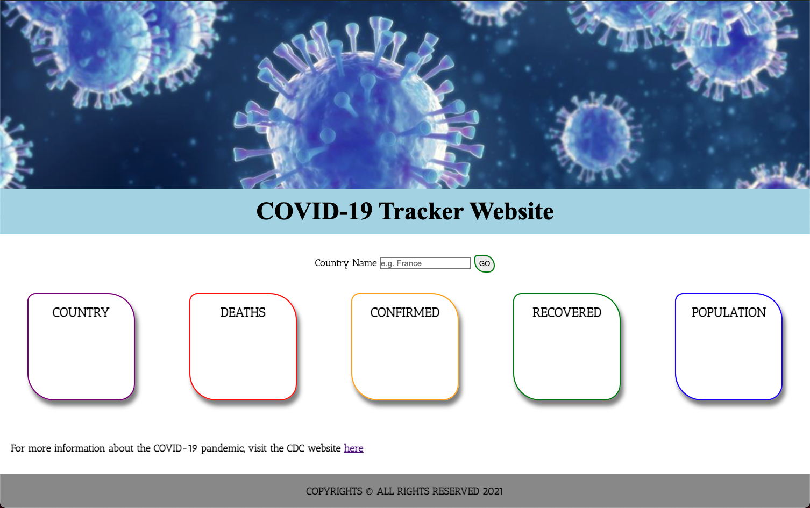

# COVID 19 TRACKER

A simple web application to track COVID-19 cases and stats by country.

## ⚙️ Technologies Used

- HTML5
- CSS3
- JS
- [jQuery](https://jquery.com/)
- [COVID-19 API](https://github.com/M-Media-Group/Covid-19-API)
- [Github](https://github.com/) (for back-up purposes)
- [Netlify](https://app.netlify.com/drop) (for deployment purposes)
- [Google Fonts](https://fonts.google.com/)

## 📷  Screenshots

## 🔌 Getting started

[Click](#) to get started and see the app online!

## 🛠 Future enhancements

- Include a option of COVID-19 tracker that allows users to see stats in a graphical format.

## 💣 Unresolved issues

- When searching a country on the input field, first letter of the country must be entered manually in uppercase for the API to return the desired information, currently transforming the text to "capitalize" does not work.