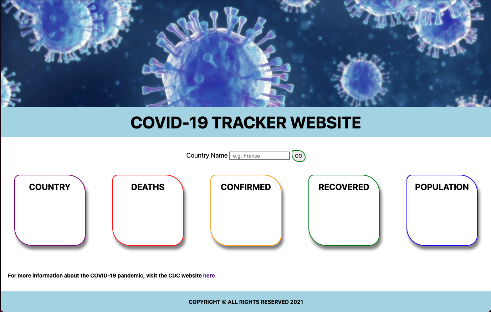

# COVID 19 TRACKER

A simple web application to track COVID-19 cases and stats by country.

## ⚙️ Technologies Used

- HTML5
- CSS3
- JS
- [jQuery](https://jquery.com/)
- [COVID-19 API](https://github.com/M-Media-Group/Covid-19-API)
- [Github](https://github.com/) (for back-up and documentation purposes)
- [Netlify](https://app.netlify.com/drop) (for deployment purposes)
- [Google Fonts](https://fonts.google.com/)

## 📷  Screenshots

## 🔌 Getting started

[Click](#) to get started and see the app online!

## 🛠 Future enhancements

- Include a option of COVID-19 tracker that allows users to see stats in a graphical format.

## 💣 Unresolved issues

- When looking at the website from a mobile device, images and some content may not display, only material displayed will be the title, searchbox and content boxes.